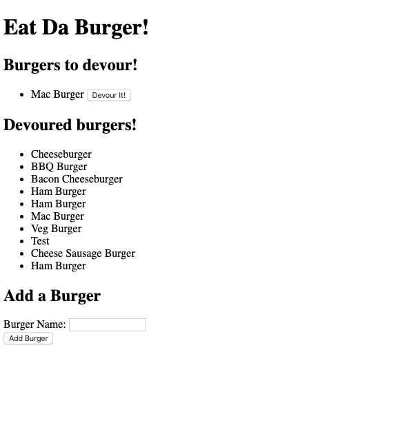
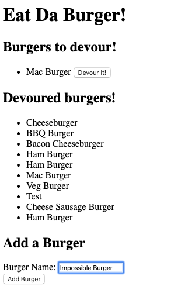
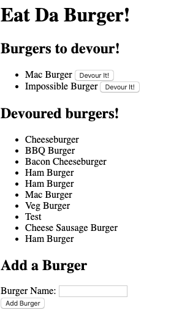
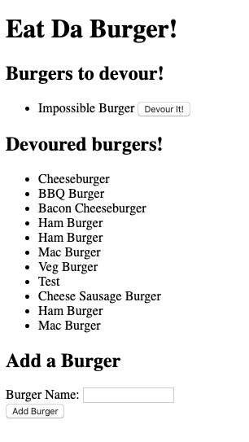

# Eat-Da-Burger
With this app, we are creating a burger logger with MySQL, Node, Express, Handlebars and a homemade ORM. With this, we can add burgers the user wants to eat, then when they have devoured it, it will log in the "Eaten" section.

## Why
Everyone likes a good burger. With this app, keep track of burgers that make your mouth water. Cross them off when you finally get to dig in.

## The Process
I started with creating all the folders and files I knew I would need. Then immediately downloaded all the dependancies for this app. Then I made the table to use to get all my values, and linked them to MySQL. After that, I started building the files from a top down file structure starting with the config folder. I ended with the views folder where I inserted all my code into the html that displays on the page. 

## Screenshots

## Dependacies
MySQL
Node
Express
Handlebars

## Github page
https://github.com/j-senak/Eat-Da-Burger
